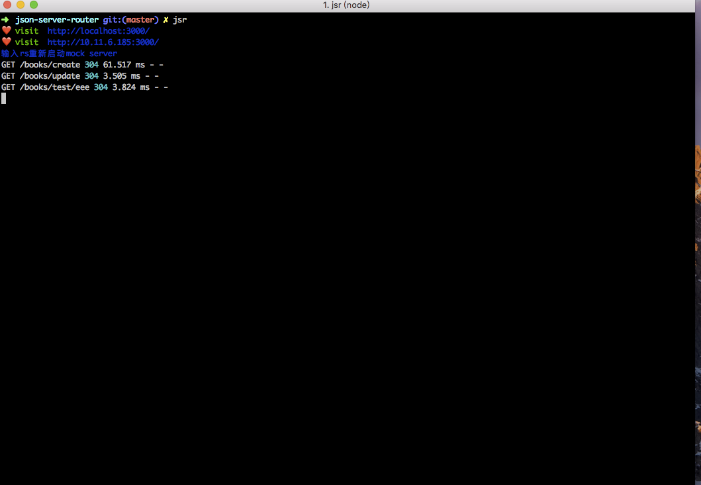
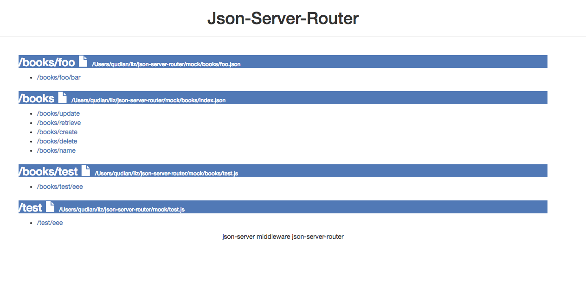

# json-server-router

json-server-router 的作用是提供一个简明的方式构建出拥有任意的路由的 `mock server`
其底层依赖[json-server](https://github.com/typicode/json-server)所构建，所以在不出意外的情况下同时也拥有`json-server`的所有功能

## json-server-router 要解决的问题

在使用 json-server 时你写了如下文件(db.json) 也就代表你得到了四个 mock 接口
`/update` ,`/retrieve`, `/create` ,`/delete`
但是实际的需求中接口路由肯定不能这么简单你需要的可能是 `/aaa/bbb/ccc/update`这样的形式,虽然`json-server`可以配置`rewrite`可以解决部分问题，但是这并不简单，接下来我们来看一下`json-server-router`的方式

```json
// db.json
{
  "update": { "code": 200, "message": "succeed", "data": true },
  "retrieve": { "code": 200, "message": "succeed", "data": true },
  "create": { "code": 200, "message": "succeed", "data": true },
  "delete": { "code": 200, "message": "succeed", "data": true }
}
```

## json-server-router 使用方式

json-server-router 的实现理念是根据目录结构，构建出想要的接口形式
假设我们的目标接口为 `/aaa/bbb/ccc/update`
那么我们只需构件出对应的目录结构
当遇到名称为 `index` 的文件路径拼接的时候会忽略`index`，当遇见键值为 `index`路径拼接同样也会忽略`index`

```bash
- aaa
  - bbb
    + ccc.json   // 在ccc.json中添加 update
or 

- aaa
  - bbb
    - ccc
      +index.json // 在index.json中添加update

```

### 假设`/books/index.json`内容如下  

```json
{
  "index": { "code": 200, "message": "succeed", "data": true }, // /books/
  "retrieve": { "code": 200, "message": "succeed", "data": true },// /books/retrieve
  "create": { "code": 200, "message": "succeed", "data": true },// /books/create
  "delete": { "code": 200, "message": "succeed", "data": true }// /books/delete
}
```

### 简单的路由生成示意大概下面这个样子,`mock`为 mock 文件的根目录

```bash
mock/books/index.json
-mock
 + index.json    ------>   /xxx
 + book.json     ------>   /book/xxx
 - foo
   + index.json  ------>  /foo/xxx
   + bar.json    ------>  /foo/bar/xxx
```

## 安装&使用

当前全局安装之后你会得到一个叫`jsr`的全局命令,根据前面的介绍这时候其实你只需构件出一个`mock files` 的根目录就足够了

```bash
$ npm install json-server-router -g
$ jsr --root mock
```

## 命令参数

```bash
jsr [options]

Options Required:
  --root, -r  Paths to mock files parent dir          [string] [required]

Options:
  --config           Path to JSON config file  [string] [default:jsr.config.js]
  --port, -p         Set port                    [number] [default: 3000]
  --host                                [string] [default: "10.11.6.185"]
  --simple, -s       simple pattern            [boolean] [default: false]
  --static           Set static files directory(same as json-server)
                                             [string] [default: "public"]
  --watch, -w        Watch file(s)             [boolean] [default: false]
  --open, -o         open                      [boolean] [default: false]
  --middlewares, -m  Paths to middleware files TODO               [array]
  --help, -h         Show help                                  [boolean]
  --version, -v      Show version number                        [boolean]

Examples:
  jsr --root mock
  jsr --root mock --port 3000
```  

### 简要说明

- `config` 设置配置文件默认配置文件的地址是当前目录的下的`jsr.config.js`
- `static` 静态资源的地址跟`json-server`是一致的，需要注意的是如果 `static`路径存在的话`json-server-router`会自动创建一个包含所有路由的`index.html`，如果`static`目录不存在，不会自动创建目录生成`index.html`
- `simple` 默认情况下`json-server`的`post`类型接口是向文件添加数据，当设置`simple`为`true`的时候`post`行为会变成跟`get`一致直接返回mock data
- `watch` 监控文件变化自动重新加载

## `jsr.config.js` simple

```js
module.exports = {
  root: 'mock',
  port: 3000,
}
```

## 战斗人员可以作为`json-server`中间件引用

可以参考`cli/server.js`

```js
const jsonServer = require("json-server")
const server = jsonServer.create()
const middlewares = jsonServer.defaults() // { static: 'public' }
const JsonServerRouter = require("json-server-router")

/**
 * @prop {string} root mock文件根目录默认为 'mock'
 * @prop {number} port 端口号跟json-server 一致 默认为 3000
 * @prop {string} publicPath 生成默认首页的地址，跟json-server 配置一致 默认'public',如果修改路径的话那么json-server 对应的配置也要改
 * @prop {bool} open 是否用浏览器打开 默认 true
 */

const router = new JsonServerRouter({
  root: "mock",
  port: 3000,
  publicPath: "public"
})

server.use(middlewares)

server.use(router.routes())
server.use(router.rewrite())

server.listen(3000, () => {
  console.log("JSON Server is running")
})
```

## 演示




